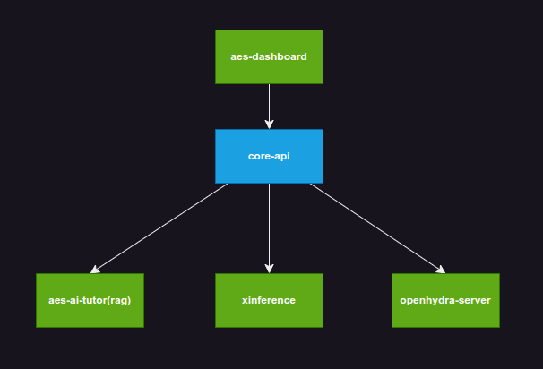

# core-api

* core-api 项目是 openhydra-2.0 版本的核心 api 项目，他主要将前端和后端的交互进行了封装，提供了一些基础的功能，比如用户登录，用户注册权限管理等等。
* openhydra 致力于提供在线的稳定的 ai 教育领域的平台服务，他可以快速的在任何 k8s 环境中部署

## core-api 项目和其他项目组件的关系

## 快速开始

### 通过 iso 整机推操作系统和 openhydra-2.0

详见 [iso 安装指南](docs/installation/iso-installation-guide.md)

### 访问 dashboard

* 打开浏览器输入地址 `http://[ip]:30001`
  * 用户名/密码 -> aes-admin/YXNlLXBhc3N3b3Jk

### 用户手册

* [用户手册](https://github.com/openhydra/docs/blob/main/UserGuide.md)

### 开发贡献

请按照 pr 形式来提交代码，我们会尽快的 review 你的代码，非常感谢您的参与和贡献
